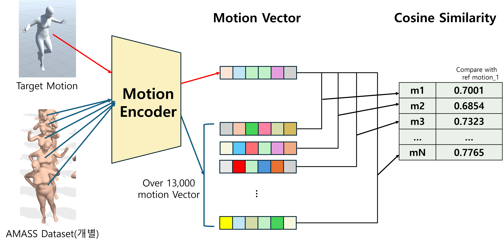

# Motion Similarity Check

- 이 프로젝트는 Motion Generation Network인 **TMR**의 인코더 부분을 활용하여 동작들 간의 유사도를 체크하고 정리한 프로젝트임.
- **TMR** 레포지토리의 일부 파일을 수정 및 추가했으며, 원본은 [링크]({https://github.com/Mathux/TMR})에서 확인할 수 있음.

## 주요 내용

- 타겟 동작을 설정한 후 기존 데이터셋의 전체 시퀀스와 비교하여 유사한 동작들을 도출함.
- 유사도를 도출하기 위해 동작 생성 네트워크인 **TMR**의 **Motion Encoder**를 활용함.
- 타겟 동작들과 데이터셋 안의 동작들 간의 시퀀스 비교 결과를 **CSV** 파일로 정리함.

## Motivation

텍스트 설명 - 동작 페어로 구성된 동작 데이터셋이 있음. 이때, 타겟 모션과 비슷한 모션을 데이터셋 내에서 찾는 방법에 대해 고민하게 됨. 타겟 모션은 **text description**이 없으며, 새로운 모션을 생성할 수 없는 상황이라고 가정함.

동작들의 피쳐를 추출하여 비교하고 유사도를 측정하는 과정의 개발이 필요했음.

## 제안 방법

기존 동작 생성 네트워크의 **Motion Encoder**를 활용하여 동작들 간의 유사도를 도출함.

동작 데이터가 **Motion Encoder**를 통과하면 **Latent Vector**가 추출됨. 타겟 동작과 비교할 동작을 각각 **Latent Vector**로 변환한 후, 이를 **코사인 유사도**로 비교하여 유사도를 측정함.

타겟 동작과 데이터셋의 동작을 비교하기 위해 사전 전처리를 진행함:

- 모든 동작의 이동 값과 최상위 관절의 각도를 0으로 초기화 (Translation, Pelvis = 0)
- **Motion Encoder**에 입력할 수 있도록 데이터셋의 피쳐를 변환 (SMPL → HumanML3D, 기존 스크립트 사용)

[전처리 스크립트](https://github.com/JuicyJeong/TMR_jw/blob/master/datasets/preprop/identify_pelpos_amass.ipynb)

* 타겟 동작을 로드한 후 PyTorch의 데이터로더를 새로 설정함. 모든 동작의 길이는 타겟 동작과 동일하게 설정했고, 데이터셋의 동작들을 Window Slide 방식으로 타겟 동작과 비교할 수 있도록 설정함.
[데이터 로더 & 실행](https://github.com/JuicyJeong/TMR_jw/blob/master/jw_compare_sim_ver2.py)

이후 코사인 유사도를 비교한 결과를 CSV 파일로 저장하고, 일정 유사도 이상의 데이터를 필터링하여 전처리 전의 데이터를 찾아옴. 타겟 동작과 유사한 동작을 시각화하여 비교함.

| ref_file_name    | src_file_name   | Cos_Similarity | max_frame_start | max_frame_end |
|------------------|-----------------|----------------|-----------------|---------------|
| Ascend_Idle.npy  | 000466.npy       | 0.700204194    | 0               | 33            |
| Ascend_Idle.npy  | 000683.npy       | 0.702683508    | 4               | 46            |
| Ascend_Idle.npy  | 000683.npy       | 0.707437932    | 8               | 50            |
| Ascend_Idle.npy  | 000683.npy       | 0.711345494    | 12              | 54            |
| Ascend_Idle.npy  | 000683.npy       | 0.716152549    | 16              | 58            |
| ...              | ...              | ...            | ...             | ...           |

[결과 처리](https://github.com/JuicyJeong/TMR_jw/blob/master/datasets/preprop/sim_result.ipynb)

{유니티 스크린샷(later...)}

## 한계점
유사도가 0.7 이상의 결과값을 추출하고, 높은 순으로 정렬하여 결과를 확인했지만 정성적으로 좋은 결과를 얻지 못함.
Align 과정에서 Pelvis와 Translation의 값을 0으로 초기화한 후 동작을 비교한 것이 문제였다고 추측됨.
동작들의 Align 과정을 재정립하거나 시퀀스 정렬 없이 비교하거나, 다른 유사도 측정 방법(metric)을 사용하는 것을 고려해야 함.
